# Juniper Usage Guide

## Table of Contents
1. [Using JunOS Olive in GNS3](#0-using-junos-olive-in-gns3)
1. [Device Login](#1-device-login)
1. [Initial Configuration](#2-initial-configuration)
1. [Interface Configuration](#3-interface-configuration)
1. [OSPF Configuaration with Tpoology](#ospf-configuaration-with-tpoology)
1. [BGP Configuration with Topology](#4-bgp-configuration)
1. [JunOS Command Guide](#junos-commands)


---
---

## 0. Using JunOS Olive in GNS3


---
## 1. Device Login
- Start the device
- Access the terminal/console
- login using `root` user and no password

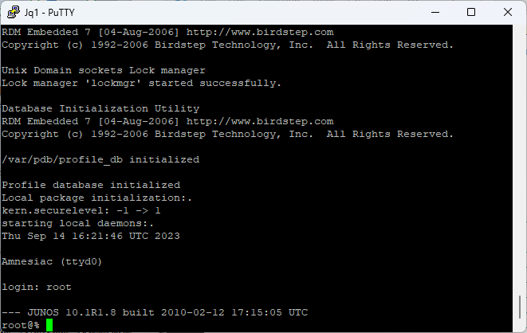

---
## 2. Initial Configuration

### 2.1 Enter Conmmnad Line Interface (CLI)

```bash
root@%cli
```
Use `show configuration` command to see the configuration. 

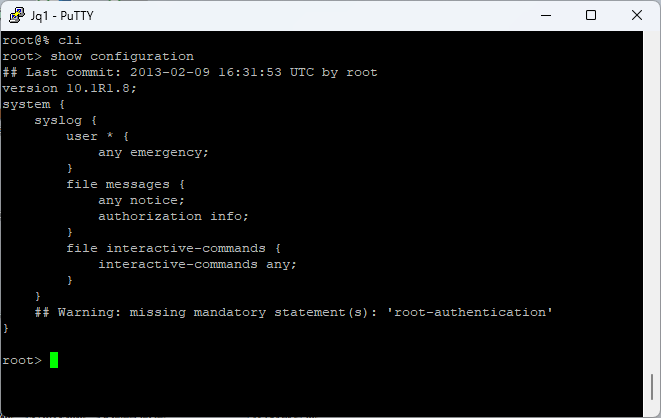

Or use `show configuration | display set` to show configurations in different way.


### 2.2 Enter Configuration
Use `configure` command to enter configuration mode. (Use `exit` to exit from the configuration mode.)

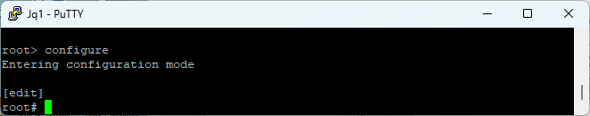

To run a command from `configuration` mode menu, preceed the command with `run`. For example to ping, use `run ping 1.1.1.1`.
 
### 2.3 Set Router Password

You need to set password for the router and a superuser, to perform any configuration on the router. Use the following 'set' comamands in the `cli`. Use `commit` command for the new settings to take effect.

```bash
set system root-authentication plain-text-password 
set system login user user1 class super-user

commit
```
---
## 3. Interface Configuration

Let's use this sample topology to configure the interfaces of the router Jq1, which is a juniper router (**JunOS Olive**).

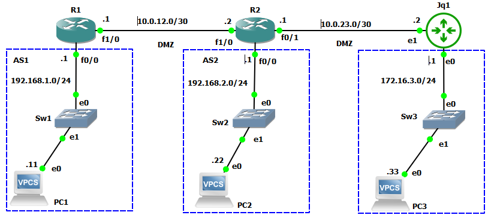

#### R1 Configuration (Cisco IOS)

```yaml
interface FastEthernet0/0
 ip address 192.168.1.1 255.255.255.0
 speed auto
 duplex auto
!
interface FastEthernet1/0
 ip address 10.0.12.1 255.255.255.248
 speed auto
 duplex auto
!
router bgp 1
 bgp log-neighbor-changes
 network 192.168.1.0
 neighbor 10.0.12.2 remote-as 2
```

#### R2 Configuration (Cisco IOS)
```yaml
interface FastEthernet0/0
 ip address 192.168.2.1 255.255.255.0
 speed auto
 duplex auto
!
interface FastEthernet0/1
 ip address 10.0.23.1 255.255.255.252
 speed auto
 duplex auto
!
interface FastEthernet1/0
 ip address 10.0.12.2 255.255.255.248
 speed auto
 duplex auto
!
router bgp 2
 bgp log-neighbor-changes
 network 192.168.2.0
 neighbor 10.0.12.1 remote-as 1
 neighbor 10.0.23.2 remote-as 3
```


### 3.1 Hostname and Interface Configuration (JunOS)

Use the command `show interfaces terse` to see the list of interfaces and their status, compact mode. (Without `terse`, a detailed list will be shown.)

📝 **Note** that interfaces *e0*, and *e1* correspond to *em0*, and *em1*, respectively, in the list below.  

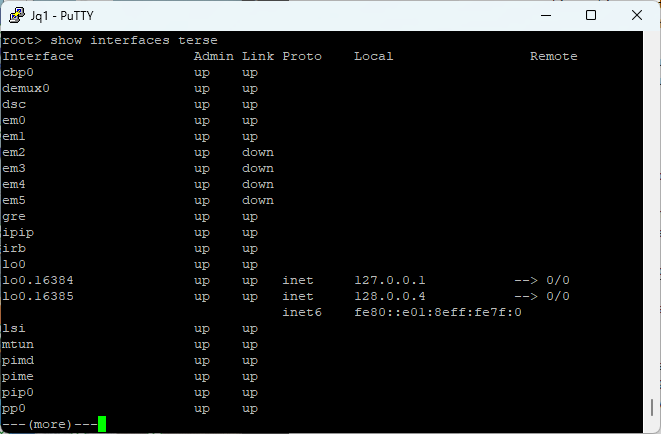

Use `set system host-name` command to configure the hostname of device. Use the `set interface` command to configure interfaces. Notice that we are configuring IPv4 (`family inet`). Also, note that we are placing the interfaces in VLAN 0 (e.g., em1.**`0`**).


```bash
set system host-name Jq3
set interfaces lo0.0 family inet address 10.0.0.3/32 
set interfaces em0.0 family inet address 172.16.3.1/24 
set interfaces em1.0 family inet address 10.0.23.2/30 

commit
```

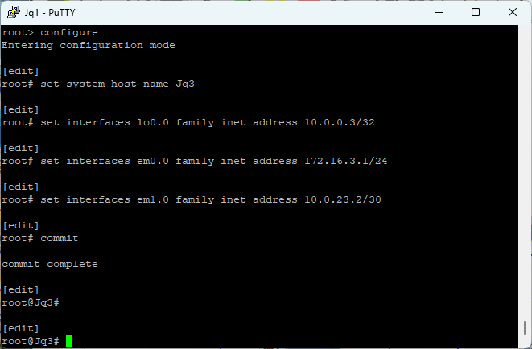

Verify the setting using the command `show interfaces` or `show interfaces | display set`.

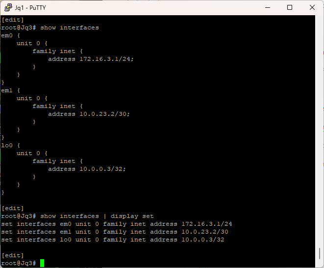

Now you can test connectivity from PC3. It should be successful. 

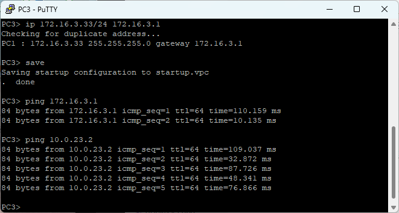

---

## OSPF Configuaration with Topoology

(TBD)


## 4. BGP Configuration

### 4.1 First, set the router ID and Autonomous System Number (**ASN**).
```bash
configure
set routing-options autonomous-system 3
set routing-options router-id 10.0.0.3

```

### 4.2 BGP configuations go in a group (i.e., a container of commands).

Using `edit` to combine all the relevant configurations.
```bash
edit protocols bgp group peerAS2
    set type external                     #eBGP
    set neighbor 10.0.23.1                #Peer router's interface IP address
    set peer-as 2                         #Peer (remote) AS
    #set authentication-key secret23      #Optional
    #set export ExportPolicyToAS2         #Point to a policy, when used
top
```

Or using individual lines.

```bash
set protocols bgp group peerAS2 type external                     
set protocols bgp group peerAS2 neighbor 10.0.23.1              
set protocols bgp group peerAS2 peer-as 2                        
#set protocols bgp group authentication-key secret23      #Optional
set protocols bgp group export ExportPolicyToAS2         #Point to a policy, when used
```

### 4.3 Create Export Policy Statements

```bash
edit policy-options policy-statement ExportPolicyToAS2 
    set term 1 from route-filter 172.16.3.0/24 exact  
    set term 1 then accept
    #All lines with same term number is a single statement
top   #End of edit block
```
 Or as inidividual lines.
```bash
set policy-options policy-statement ExportPolicyToAS2 term 1 from route-filter 172.16.3.0/24 exact  
set policy-options policy-statement ExportPolicyToAS2 term 1 then accept

```


### Verify
After all the configurations above, we can verify the routing table and bgp table in each router.

#### <u>Routing Table </u>

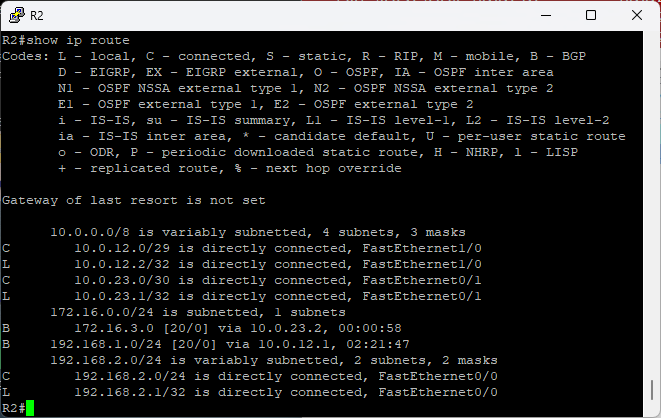

#### <u>BGP Table</u>

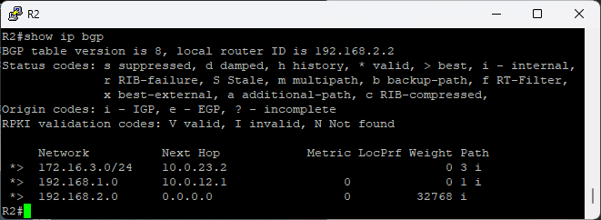


```bash
R2#show ip route
Codes: L - local, C - connected, S - static, R - RIP, M - mobile, B - BGP
       D - EIGRP, EX - EIGRP external, O - OSPF, IA - OSPF inter area
       N1 - OSPF NSSA external type 1, N2 - OSPF NSSA external type 2
       E1 - OSPF external type 1, E2 - OSPF external type 2
       i - IS-IS, su - IS-IS summary, L1 - IS-IS level-1, L2 - IS-IS level-2
       ia - IS-IS inter area, * - candidate default, U - per-user static route
       o - ODR, P - periodic downloaded static route, H - NHRP, l - LISP
       + - replicated route, % - next hop override

Gateway of last resort is not set

      10.0.0.0/8 is variably subnetted, 4 subnets, 3 masks
C        10.0.12.0/29 is directly connected, FastEthernet1/0
L        10.0.12.2/32 is directly connected, FastEthernet1/0
C        10.0.23.0/30 is directly connected, FastEthernet0/1
L        10.0.23.1/32 is directly connected, FastEthernet0/1
      172.16.0.0/24 is subnetted, 1 subnets
B        172.16.3.0 [20/0] via 10.0.23.2, 00:00:58
B     192.168.1.0/24 [20/0] via 10.0.12.1, 02:21:47
      192.168.2.0/24 is variably subnetted, 2 subnets, 2 masks
C        192.168.2.0/24 is directly connected, FastEthernet0/0
L        192.168.2.1/32 is directly connected, FastEthernet0/0

```


```bash
R2#show ip bgp
BGP table version is 8, local router ID is 192.168.2.2
Status codes: s suppressed, d damped, h history, * valid, > best, i - internal,
              r RIB-failure, S Stale, m multipath, b backup-path, f RT-Filter,
              x best-external, a additional-path, c RIB-compressed,
Origin codes: i - IGP, e - EGP, ? - incomplete
RPKI validation codes: V valid, I invalid, N Not found

     Network          Next Hop            Metric LocPrf Weight Path
 *>  172.16.3.0/24    10.0.23.2                              0 3 i
 *>  192.168.1.0      10.0.12.1                0             0 1 i
 *>  192.168.2.0      0.0.0.0                  0         32768 i
R2#

```
#### Routing Table (JunOS)

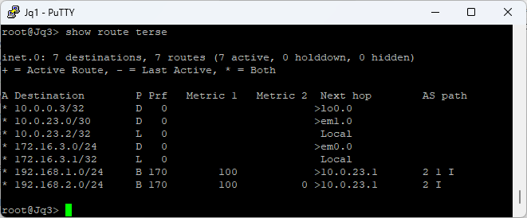

```bash
root@Jq3> show route terse

inet.0: 7 destinations, 7 routes (7 active, 0 holddown, 0 hidden)
+ = Active Route, - = Last Active, * = Both

A Destination        P Prf   Metric 1   Metric 2  Next hop        AS path
* 10.0.0.3/32        D   0                       >lo0.0
* 10.0.23.0/30       D   0                       >em1.0
* 10.0.23.2/32       L   0                        Local
* 172.16.3.0/24      D   0                       >em0.0
* 172.16.3.1/32      L   0                        Local
* 192.168.1.0/24     B 170        100            >10.0.23.1       2 1 I
* 192.168.2.0/24     B 170        100          0 >10.0.23.1       2 I

root@Jq3>
```

Also, use this command to see bgp information

```bash
root@Jq3>show route protocol bgp terse
```


#### Test connectivity from the JunOS router (Jq1). 


⚠️ **Important** Make sure to source it from 172.16.3.1 interface. By default the IP packet will use the exit interface for source IP address. In the example topology, the exit interface IP address will be 10.0.23.2. However, R1 has no idea of this network. But, through BGP R1 knows about 172.16.3.0 network.

Here is the routing table of R1.

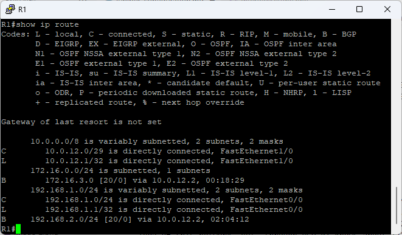


Test end-to-end connectivity

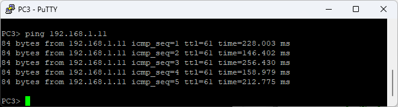


---

## 5. BGP Message Flow


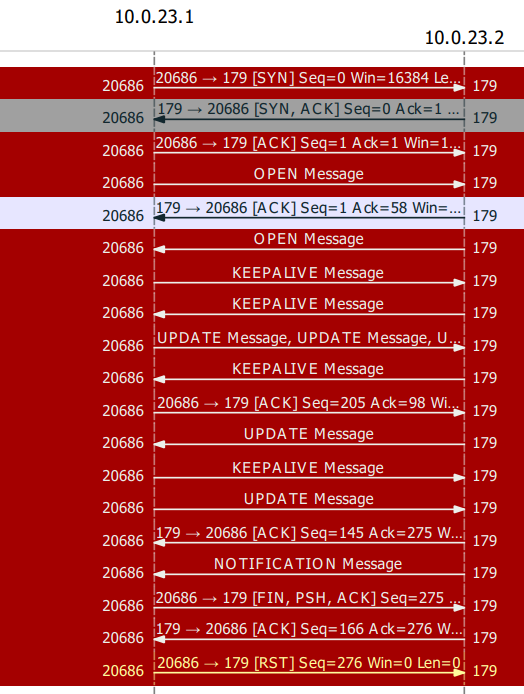

<hr>

## JunOS Commands

### Default Factory Reset

```
user> configure
[edit]
user# load factory-default
[edit]
user# delete system commit factory-settings
[edit]
user# commit
```


---

#### Default Factory Reset

```
user> configure
[edit]
user# load factory-default
[edit]
user# delete system commit factory-settings
[edit]
```
#### Compare Configuration Change, Commit, Rollback, Quit

```
show | compare
rollback
commit check
commit

commit and-quit
exit
```


#### Set root password

```
set system root-authentication plain-text-password 
commit
```

#### Create User

```
set system login user user1 class super-user
commit
```

#### Set Hostname
```
set system host-name Jq3
commit
```
#### Set Interface IP Address, Description
```
set interfaces lo0.0 family inet address 10.0.0.3/32 
set interfaces lo0 unit 0 family inet address 10.0.0.3/32
set interfaces em0.0 family inet address 172.16.3.1/24 
set interfaces em1.0 family inet address 10.0.23.2/30 
set interfaces fe-0/0/0 description "to Router2 fe-0/0/0"

commit
```

#### Remove/Delete a Configuration
```
delete interfaces lo0.0 family inet address 10.0.0.3/32 
```

#### Set Domain name and Name server
```
set system domain-name rayka-co.com 
set system name-server 192.168.1.240 
set system name-server 8.8.8.8  
```

#### Set NTP Server, Timezone
```
set system ntp server pool.ntp.org
set system ntp server 194.225.150.25 
set system time-zone Asia/Delhi
```
#### Allow Remote Access and Root Login
```
set system services telnet 
set system services ssh 
set system services ssh root-login allow 
set system services web-management https system-generated-certificate
set system services web-management https interface fxp0.0

commit
run show configuration | display set | grep services
```

#### Radius Server Authentication
```
set system radius-server 10.0.0.100 secret mySecret
set system authentication-order radius password
```
#### Erase All Configuration
```
request system zeroize 
```
### Routing
#### Configure Static Route
```
set routing-options static route 200.200.200.1/24 next-hop 30.30.0.100
```
#### Configure Default Route
```
set routing-options static route 0.0.0.0/0 next-hop 10.0.21.2
```

#### Blackholing Routes (Discarding Traffic)
```
set routing-options static route 1.0.0.0/8 discard
```

#### OSPF
```
set protocols ospf area 0.0.0.0 interface so-0/0/0 

set protocols ospf area 0.0.0.0 interface so-0/0/1 hello-interval 5 dead-interval 20
```

#### Remove OSPF Interface (or any configuration)
```
delete protocols ospf area 0.0.0.0 interface so-0/0/0 
```

#### Set Router ID (for OSPF and BGP)
```
set routing-options router-id 99.0.0.99
```

## Display

#### Display Current Configuration
```
user> show configuration
user> show configuration | display set
```

#### Display Interface Information 
```
show interfaces 
show interfaces | display set
show interfaces terse
show interfaces detail
show interfaces extensive
show interfaces fe-0/0/0
show interfaces brief fe-0/0/0
``` 

#### Display Protocol Information
```
#show protocols ospf
>show ospf overview
>show ospf database
>show ospf database router (network, netsummary, )
>show ospf neighbor
>show ospf database summary
>show ospf database detail


show ip bgp protocols terse
```
#### Display Routing Table

```
show route
show route terse
show route protocol ospf terse
```
```
 show route table inet6.0
```
#### View Routes Installed in the Forwarding Table
```
show route forwarding-table
```


